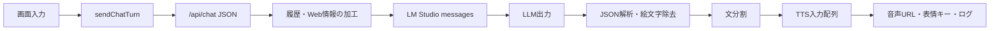

# 会話生成パイプライン解析

## 1. 対象

この文書は、ブラウザの入力がどのように加工され、LM Studioへ渡り、返答がTTS用データへ変換されるかを追います。

主な実装箇所:

- `static/app.js`: `sendChatTurn()`, `startAutoConversation()`, `continueAutoConversation()`
- `app.py`: `/api/chat`, `compact_messages_for_context()`, `request_lmstudio()`

## 2. 入出力の全体像



## 3. ブラウザからサーバへ渡すデータ

`sendChatTurn()` は、入力文だけでなく、現在選択中のキャラクター状態を1ターン分のリクエストへ展開します。

| JSON項目 | 加工元 | 用途 |
| --- | --- | --- |
| `message` | ユーザー入力または自動会話用の指示文 | 今回の入力 |
| `history` | 送信直前に複製したブラウザ履歴 | LLMの会話コンテキスト |
| `speaker`, `speakerSlot` | `activeStage()` | 話者名と1P/2Pの区別 |
| `systemPrompt` | キャラクタープロファイル | 人格・会話方針 |
| `ttsCaption` | キャラクタープロファイル | 音声演技の恒常設定 |
| `referencePath` | キャラクタープロファイル | 参照音声 |
| `replyLength` | UI | 返答長、最大トークン、TTS分割上限 |
| `emojiStyle`, `autoEmoji` | UI | 手動またはLLMによる感情指定 |
| `speechRate` | UI | TTSのduration scaleへ変換 |
| `webSearch`, `webContext` | UIと自動会話状態 | 一時的な外部情報 |
| `twoOnlyMode` | UI | キャラ同士だけの世界設定 |

### 履歴の送信タイミング

通常入力では、画面にユーザー発言を追加する前の `historyBeforeSend` をサーバへ送ります。今回の入力は別途 `message` として送られ、サーバ側で履歴末尾へ追加されます。

この方法には、同じユーザー発言が履歴と `message` の両方に重複するのを避ける効果があります。

LLM返答はブラウザ側で次の形式にして履歴へ戻されます。

```text
リノン: 返答本文
```

話者名を本文へ埋めることで、OpenAI互換APIの `assistant` roleだけでは失われる2Pの話者情報を維持しています。

## 4. サーバ側の前処理

### 4.1 履歴のフィルタ

サーバは `user` と `assistant` roleだけを採用します。不正な型やその他のroleは除外されます。

### 4.2 Web検索メモ

Web検索が有効な場合、現在文と直近8件の履歴から検索語を組み立てます。

抽出対象:

- 鉤括弧・引用符内の2から40文字
- 英数字語
- 2文字以上のカタカナ語
- 「評判」「レビュー」「公開日」「声優」などの意図語

過去履歴から最大6語程度を継承し、現在文の語と合わせて最大8語の検索クエリにします。これにより「その映画の評判は？」のような省略入力でも、前の会話に出た固有名詞を引き継げます。

検索結果はsystem messageではなく、次のような追加の `user` messageへ加工されます。

```text
今回の進行指示/質問: ...
共有Webメモとして保持中の検索語: ...
Web検索結果です。検索語: "..."
...
```

検索情報を人格指示と分離し、「補助情報」「断定禁止」と明記するのが特徴です。

## 5. コンテキスト圧縮

この実装はトークナイザを使わず、文字数に固定オーバーヘッド32を加えた値をコンテキストコストとみなします。

```text
1 messageの推定コスト = contentの文字数 + 32
```

### 圧縮条件

- 実効上限は、UI指定値と `LM_COMPACT_CONTEXT_LIMIT` の小さい方
- 履歴が上限以内かつ直近保持件数以内なら、ほぼそのまま送信
- 長い場合は、直近 `LM_RECENT_MESSAGE_COUNT` 件を残す
- それ以前は規則ベースの短い圧縮ログに変換

### 要約方法

別のLLMによる意味要約ではありません。古い各発言を95文字程度に切り、最大14件を並べ直します。お題は別枠で最大5件保持します。

利点:

- 追加の推論時間やモデル呼び出しが不要
- 要約LLMによる事実改変が起きにくい
- 動作が予測しやすい

制約:

- 長期的な嗜好や約束を意味的に抽出しない
- 古い発言の末尾側だけが残りやすい
- 文字数は実トークン数と一致しない

## 6. LM Studio向けsystem messageの組み立て

`request_lmstudio()` は複数の制御を1つのsystem messageへ連結します。

1. 日本語で自然に返すという基本命令
2. 現在の話者名
3. キャラクターの `systemPrompt`
4. ユーザーの呼称制御
5. 特殊モードの制約
6. 返答長の指示
7. 思考過程を出さない指示と `/no_think`
8. 自動感情選択を使う場合の出力スキーマ

### 返答長の三重制御

| モード | 自然言語指示 | `max_tokens` | TTSチャンク上限 |
| --- | ---: | ---: | ---: |
| short | 1から2文 | 360 | 3 |
| normal | 3から5文 | 720 | 6 |
| long | 6から10文 | 1200 | 10 |

返答長をLLMだけに任せず、出力予算と音声生成数にも反映する実用的な設計です。

### 自動感情選択

Irodori-TTSから読み込んだ絵文字一覧を、ラベル・説明付きでsystem messageに展開します。LLMには次のJSONだけを返すよう要求します。

```json
{"text":"返答本文","emoji":"絵文字または空文字"}
```

これにより、自然言語生成と非言語的な演技選択を1回のLLM呼び出しで得ています。

## 7. LLM出力の後処理

`parse_lmstudio_reply()` は次の順に処理します。

1. Markdownコードフェンスがあれば中身だけ取り出す。
2. JSONとして解析する。
3. `text` または `reply` を本文として採用する。
4. `emoji` がIrodoriの許可リストに存在する場合だけ採用する。
5. JSON解析に失敗した場合は、生の出力を本文として扱う。

許可リスト検証により、LLMが未知の絵文字を返してもTTS制御へ流しません。

その後、本文内に混入したIrodoriスタイル絵文字をすべて除去します。絵文字はTTS入力時に改めて先頭へ1つだけ付けるため、本文と制御記号を分離できます。

## 8. TTS前の文分割

本文は `。！？!?` の直後で分割されます。空白は1つに正規化されます。

チャンク数が上限を超えた場合、上限以降の文を最後の1チャンクへ連結します。本文を切り捨てない一方、最後の音声だけ長くなる可能性があります。

この分割には次の効果があります。

- 長文を一度に生成するよりTTSの失敗範囲を小さくする
- 文ごとに再生キューへ積める
- 最初の音声から再生を開始しやすい構造になる

ただし現在のサーバ処理は全チャンクを同期生成してから応答するため、実際の初回再生開始は全音声生成後です。

## 9. 自動会話特有の加工

自動会話はLLM同士を直接接続していません。フロントが交互に話者を選び、次の情報を「外部からの進行指示」として通常の `/api/chat` へ送ります。

- 会話のお題
- ターン番号
- 直前の相手の発言
- 相槌だけで終わらない指示
- 次の発言につながる余韻を残す指示

LLMの返答を次のLLM入力へ再構成する、フロント主導のターンオーケストレーションです。

## 10. 研究上の要点

- 人格、会話履歴、演技選択を別データとして持ち、送信時に統合している。
- 感情分類専用モデルを増やさず、会話LLMに構造化出力させている。
- トークン精密計算より、軽量で予測可能な文字数圧縮を選んでいる。
- 2P話者情報はroleではなく、履歴本文の話者接頭辞で保持している。
- Web情報は恒久記憶へ保存せず、その会話の補助メモとして注入している。

