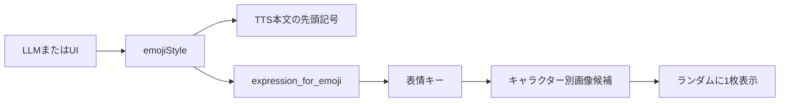

# 表情差分システム解析

## 1. 設計の中心

表情システムは画像認識や感情推定モデルを使いません。Irodori-TTSの発話スタイル絵文字を共通の中間表現として使います。



音声と表情が同じ `emojiStyle` から派生するため、別々の感情判定を走らせず同期できます。

## 2. 絵文字から表情キーへの変換

`expression_for_emoji()` は、Irodori絵文字をUIで扱いやすい英字キーへ写像します。

例:

| 絵文字 | 表情キー |
| --- | --- |
| `😊`, `😆` | `happy` |
| `😏`, `🤭` | `teasing` |
| `😭` | `sad` |
| `😪`, `😴`, `🐢` | `sleepy` |
| `🫶`, `😌` | `tender` |
| `😟`, `😰`, `🥺`, `😖` | `worried` |
| `📖` | `narration` |
| 未登録・空 | `neutral` |

複数の音声スタイルを1つの視覚表情へ縮約しています。音声側の表現粒度の方が細かく、画像側は少ないカテゴリで受け止める設計です。

## 3. キャラクターごとの画像解決

各キャラクターは次の構造を持ちます。

```json
{
  "expressions": {
    "neutral": ["/Character/example/expressions/neutral/a.png"],
    "shy": [
      "/Character/example/expressions/shy/a.png",
      "/Character/example/expressions/shy/b.png"
    ]
  }
}
```

UIは要求された表情キーを探し、存在しなければ `neutral` を使います。それもなければキャラクターの `portrait`、最後にアプリ既定画像へフォールバックします。

## 4. 差分のランダム選択

同じ表情キーに複数画像がある場合、再生開始時にランダムで1枚選びます。

この方法は状態機械を作らずに見た目の反復感を減らせます。ただし次の性質があります。

- 直前と同じ画像を避ける処理はない
- 感情強度に応じた段階選択ではない
- ファイル名の `_02` などに順序的意味を持たせていない

したがって `shy_01` から `shy_05` が感情強度を表していても、現状は強度ではなくランダム差分です。

## 5. 音声チャンクとの同期

LLM返答全体に対して1つの `emojiStyle` が選ばれ、分割された全音声チャンクに同じstyleと表情キーが付きます。

再生キューが次のチャンクへ移るたび、対応する `expression` で画像を再選択します。同じ感情キーでも複数差分があれば、文ごとに画像が変わる可能性があります。

音声再生終了後は両キャラクターとも `neutral` に戻ります。

## 6. 話者と表示対象

再生時の話者名がメインキャラ名と一致すればメイン立ち絵、セカンドキャラ名と一致すればセカンド立ち絵を更新します。

話者判定がキャラクターIDではなく表示名に依存しているため、2キャラクターに同じ名前を付けると表示先判定が曖昧になる可能性があります。

## 7. 発話アニメーション

表情差分とは別に、再生中は `.is-speaking` とbodyの話者classを切り替えます。CSSは立ち絵へ揺れなどのアニメーションを適用します。

つまり見た目は次の2層です。

- 静的差分: 感情キーに対応する画像
- 動的差分: 誰が再生中かを示すCSSアニメーション

口形素や音量解析によるリップシンクではありません。

## 8. 画像登録時の加工

UIから画像を追加すると:

1. ブラウザでData URLへ変換する。
2. `/api/character-image` へbase64送信する。
3. 拡張子と32 MiB上限を検査する。
4. `Character/<id>/expressions/<key>/` へ保存する。
5. 一意なファイル名を付ける。
6. 公開URLをキャラクターの配列へ追加する。

キャラクター保存時には、アプリ共通画像を参照している場合もキャラクターフォルダへコピーし、キャラ単位で自己完結する形へ寄せます。

## 9. 表情キーの正規化

キーは英数字、`_`, `-` 以外を `_` に変換します。UIで追加する場合も同様の正規化を行います。

日本語の表情名をそのままキーにはできません。UI表示上は既知キーに日本語ラベルを付けていますが、内部識別子は英字前提です。

## 10. 設計上の強みと制約

強み:

- 音声と画像の同期ロジックが単純
- キャラクターごとに画像資産を差し替えられる
- 感情分類モデルが不要
- 未定義表情でもneutralへ安全に戻る

制約:

- 1ターン1感情で、文中の感情変化を表現しにくい
- 絵文字と表情キーの対応が `app.py` に固定される
- キャラ固有の絵文字解釈を持てない
- 強度、視線、口形、姿勢を独立制御できない

## 11. 発展案

現在の単一キーを、次のような複合状態へ拡張できます。

```json
{
  "emotion": "shy",
  "intensity": 0.7,
  "gaze": "away",
  "mouth": "speaking",
  "gesture": "hands_near_face"
}
```

ただし現在の軽量さは研究用プロトタイプとして大きな利点です。まずは絵文字ごとの画像選択頻度と、音声・画像の主観的一致度を測るのが自然です。

