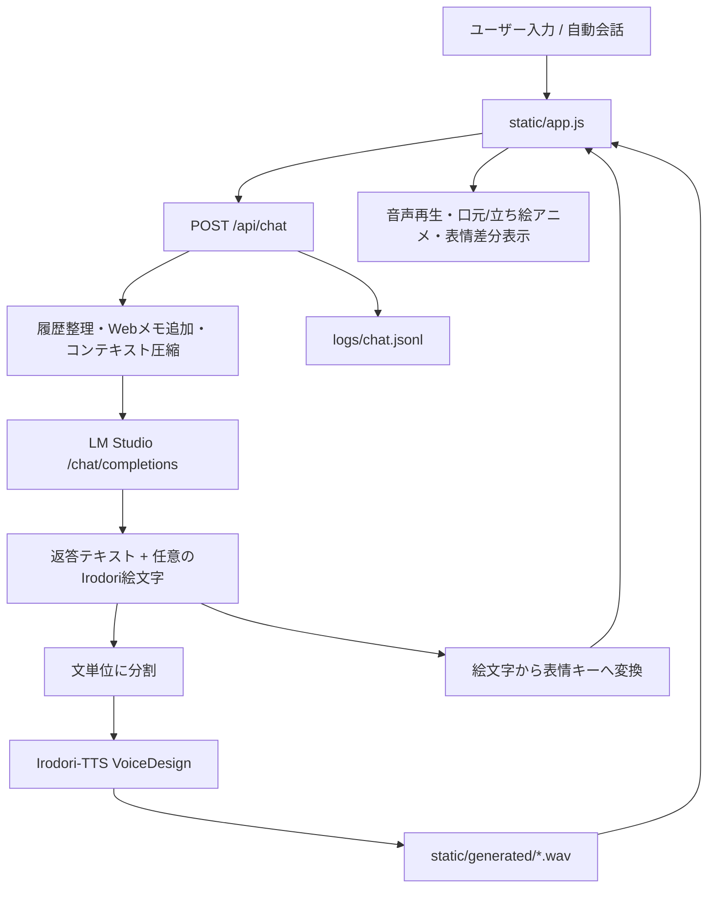

# Rinon Voice Lab 全体像

この文書は、AIエンタメ研究の観点から Rinon Voice Lab の構造を最初に把握するためのメモです。対象はこのローカルCloneの内容で、オリジナルリポジトリとIrodori-TTS/モデルはいずれもMIT Licenseである、という前提で読んでいます。

## 1. 何をするプロジェクトか

Rinon Voice Lab は、ローカルLLMとIrodori-TTSをつなぎ、キャラクター会話、音声生成、表情差分表示、会話履歴保存を1つのブラウザUIで扱う実験アプリです。

主な構成は次の通りです。

| 領域 | 主なファイル | 役割 |
| --- | --- | --- |
| サーバ | `app.py` | HTTPサーバ、LM Studio連携、Irodori-TTS呼び出し、保存処理 |
| UI | `static/index.html`, `static/app.js`, `static/style.css` | 会話画面、設定画面、音声再生、表情切替 |
| キャラクター | `Character/<id>/profile.txt`, `profile.json`, `reference/`, `expressions/` | 人格プロンプト、TTS Caption、参照音声、表情画像。手動編集の中心はTXT |
| 起動・導入 | `start_chat_uv.bat`, `start_chat_mac.sh`, `tools/install_irodori_tts.*` | Irodori-TTSの導入確認とアプリ起動 |
| 2PリモートTTS | `tools/remote_luvia_tts_server.py` | 2人目キャラの音声生成を別PCへ逃がす軽量サーバ |
| 実行時データ | `logs/`, `profiles/`, `saved_audio/`, `static/generated/` | 会話ログ、セッション保存、保存音声、生成音声 |

## 2. 大まかな処理フロー

`static/app.js` は会話送信時に、現在のキャラクター、話者スロット、人格プロンプト、TTS Caption、参照音声パス、会話履歴、モデル設定、感情/発話スタイル設定をまとめて `/api/chat` に送ります。

`app.py` 側では次の順に処理します。

1. リクエストを受ける。
2. 会話履歴を整形し、必要ならWeb検索メモを追加する。
3. 履歴が長い場合は古い会話を要約してコンテキストを圧縮する。
4. LM StudioのOpenAI互換APIへ投げる。
5. 返答とIrodori用スタイル絵文字を取り出す。
6. 返答を短い文に分割する。
7. 各文をIrodori-TTSでwav化する。
8. スタイル絵文字を表情キーに変換する。
9. UIに返し、同時に `logs/chat.jsonl` へ記録する。

## 3. キャラクターが「しゃべる」仕組み

会話生成と音声生成は分離されています。

LLM部分は `request_lmstudio()` が担当します。ここでは、現在話すキャラクター名、キャラクターの `systemPrompt`、ユーザー呼称、返答長、2P専用モード、セリフ禁止モード、Irodoriスタイル絵文字選択指示などをsystem messageに組み込みます。その後、LM Studioの `/chat/completions` に送信します。

TTS部分は `synthesize_sentence()` が担当します。Irodori-TTS側の `gradio_app_voicedesign._run_generation()` を直接呼び、次の要素を渡します。

| 要素 | 由来 | 意味 |
| --- | --- | --- |
| text | LLM返答を文分割したもの | 実際に読む本文 |
| emojiStyle | LLMが選ぶ、またはUIで指定した絵文字 | Irodori-TTSの感情/演技スタイル指定 |
| caption | キャラクターの `ttsCaption` | 声質、演技、雰囲気の自然言語説明 |
| ref_wav | キャラクターの `referencePath` | 参照音声 |
| steps | UI設定 | 生成ステップ数 |
| durationScale | speechRateから算出 | 話速制御 |

生成されたwavは `static/generated/` にコピーされ、UIから再生できるURLとして返ります。

## 4. 表情差分の仕組み

表情はTTSのスタイル絵文字から間接的に決まります。

`app.py` の `expression_for_emoji()` は、Irodori用の絵文字を `soft`, `teasing`, `sad`, `surprised`, `muffled`, `tender` などの表情キーへ変換します。UI側は返ってきた `expression` を見て、現在のキャラクターの `expressions[expression]` から画像を選びます。

同じ表情キーに複数画像がある場合、`static/app.js` の `randomExpressionImage()` がランダムに1枚選びます。これにより、同じ `shy` や `teasing` でも差分が自然に揺れます。

重要なのは、表情画像そのものをAIがリアルタイム生成しているわけではない点です。現在の実装は「音声感情スタイル - 表情キー - 事前用意された画像差分」の対応表で動いています。

## 5. 音声の感情コントロール

音声の感情制御は主に3層です。

| 層 | 実体 | 役割 |
| --- | --- | --- |
| 声質の土台 | `referencePath` | 参照音声で話者性を寄せる |
| 演技の土台 | `ttsCaption` | 声の質感、年齢感、距離感、演技方針を指定 |
| 瞬間的な感情 | `emojiStyle` | その発話だけの感情、息、間、電話越しなどを指定 |

研究上の見どころは、感情をLLM本文に直接埋め込むのではなく、LLMに「返答本文」と「TTS用絵文字」をJSONで返させ、その絵文字をIrodori-TTSと表情差分の両方に使っている点です。これにより、声と表情の同期が比較的単純なルールで成立しています。

## 6. 記憶・履歴の仕組み

このプロジェクトの記憶は、長期記憶データベースではなく、ローカル保存される会話履歴と設定です。

| 種類 | 保存先 | 内容 |
| --- | --- | --- |
| セッション | `profiles/latest_session.json` | UI設定、キャラクター選択、会話履歴 |
| キャラクター一覧 | `profiles/characters.json` と `Character/<id>/profile.*` | `profile.txt`を編集元とし、JSON類へ構造化・統合したキャラデータ |
| 会話ログ | `logs/chat.jsonl` | 各ターンの入力、返答、モデル、絵文字、表情、TTS結果 |
| 生成音声 | `static/generated/*.wav` | 直近生成された再生用音声 |
| 保存音声 | `saved_audio/` | ユーザーが明示保存した音声 |

会話時にLLMへ渡される履歴は、ブラウザ側の `history` 配列が中心です。長くなった履歴は `compact_messages_for_context()` と `summarize_old_messages()` により、古い部分を要約してコンテキスト上限内に収めます。

つまり現時点の「記憶」は、人格の永続化、セッション履歴の復元、会話ログの記録、コンテキスト圧縮による短中期記憶の維持、という構成です。ユーザーの嗜好や出来事を抽出して別メモリへ蓄積する仕組みは、まだ明確には実装されていません。

## 7. 2Pキャラクターと自動会話

2Pモードでは、メインキャラとセカンドキャラを同じUI上に表示し、話者スロット `main` / `second` を切り替えます。フロント側の `activeStage()` が、現在話すキャラのプロンプト、TTS Caption、参照音声をまとめます。

自動会話では、`static/app.js` が次に話すキャラクターを交互に選び、直前の発話やトピックを含む指示文を作って `/api/chat` に送ります。サーバ側は通常会話と同じ経路でLLM/TTSを実行します。

2Pの音声だけを別PCで生成する場合は、`ttsBackendMode` を `remote` にし、`tools/remote_luvia_tts_server.py` の `/synthesize` へ音声生成リクエストを送ります。

## 8. 注意点と今後の解析メモ

日本語ファイルはUTF-8で正常に読めます。初回調査時にこちらのPowerShell出力エンコーディングが合わず、端末上だけ文字化けして見えていました。以後の解析では、PowerShell実行時にUTF-8出力を明示して読みます。

`Character/usako/` はGit上では未追跡でした。これはユーザー側の追加キャラクターである可能性があるため、この初回整理では構造観察に留め、勝手に編集していません。
